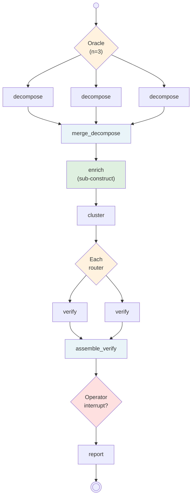

The previous walkthroughs showed each NeoGraph feature in isolation. Real pipelines combine several at once. This walkthrough shows a requirement verification system that uses Oracle ensemble, sub-construct isolation, Each fan-out, Operator interrupt, and mixed modes — all wired together.

## The graph



The pipeline:

1. **decompose** — LLM breaks a requirement into claims (think mode, Oracle ensemble x3)
2. **enrich** — sub-pipeline that looks up context and scores each claim (sub-construct)
3. **cluster** — group claims by theme
4. **verify** — verify each cluster in parallel (Each fan-out)
5. **check-results** — pause if any cluster failed (Operator interrupt)
6. **report** — format the final output

## The mixed API question

This example uses `@node` for the top-level decompose (with Oracle kwargs) but drops to declarative `Node` + `Construct` for the rest. Why?

The sub-construct (`enrich`) needs an explicit I/O boundary: `input=Claims, output=ScoredClaims`. `construct_from_module` walks a whole module into one flat Construct — it can't inline a sub-pipeline with its own isolated state. That's a legitimate boundary case where the declarative form is the right tool.

For the other scripted nodes, declarative stays for consistency with the sub-construct. In a pipeline without sub-constructs, every node here could be `@node`-decorated.

## The schemas

```python
from pydantic import BaseModel

class Claims(BaseModel, frozen=True):
    items: list[str]

class Context(BaseModel, frozen=True):
    references: list[str]

class ScoredClaims(BaseModel, frozen=True):
    scored: list[dict[str, str]]

class ClusterGroup(BaseModel, frozen=True):
    label: str
    claim_ids: list[str]

class Clusters(BaseModel, frozen=True):
    groups: list[ClusterGroup]

class VerifyResult(BaseModel, frozen=True):
    cluster_label: str
    passed: bool
    gaps: list[str]

class ValidationResult(BaseModel, frozen=True):
    passed: bool
    issues: list[str]

class Report(BaseModel, frozen=True):
    text: str
```

## The pipeline

```python
from neograph import (
    Construct, Each, Node, Operator,
    compile, node,
)
from langgraph.checkpoint.memory import MemorySaver

# Step 1 — @node with Oracle kwargs for LLM ensemble
@node(outputs=Claims, prompt="decompose", model="fast",
      llm_config={"provider_kwargs": {"temperature": 0.8}},
      ensemble_n=3, merge_fn="merge_claims")
def decompose() -> Claims: ...

# Step 2 — sub-construct with isolated state
enrich = Construct(
    "enrich",
    input=Claims,
    output=ScoredClaims,
    nodes=[
        Node.scripted("lookup", fn="lookup_context", inputs=Claims, outputs=Context),
        Node.scripted("score", fn="score_claims", inputs=Claims, outputs=ScoredClaims),
    ],
)

# Step 3 — scripted clustering
cluster = Node.scripted("cluster", fn="make_clusters", outputs=Clusters)

# Step 4 — Each fan-out over the clusters
verify = Node.scripted(
    "verify", fn="verify_cluster", inputs=ClusterGroup, outputs=VerifyResult
) | Each(over="cluster.groups", key="label")

# Step 5 — Operator pauses if any cluster failed
check_results = Node.scripted(
    "check-results", fn="check_passed", outputs=ValidationResult
) | Operator(when="needs_review")

# Step 6 — final report
report = Node.scripted("report", fn="build_report", outputs=Report)

# Assembly
pipeline = Construct(
    "full-verification",
    description="End-to-end requirement verification",
    nodes=[decompose, enrich, cluster, verify, check_results, report],
)
```

Define the scripted functions and the Operator condition. They're passed to `compile()` by name in the next step — no global registration:

```python
def merge_claims(variants, config): ...       # Oracle merge
def lookup_context(input_data, config): ...
def score_claims(input_data, config): ...
def make_clusters(input_data, config): ...
def verify_cluster(input_data, config): ...
def check_passed(input_data, config): ...
def build_report(input_data, config): ...

def needs_review(state):
    if state.check_results and not state.check_results.passed:
        return {"issues": state.check_results.issues}
    return None
```

## Running the pipeline

```python
# Checkpointer is required because Operator is in the pipeline.
# Scripted functions and the Operator condition are passed by name —
# the same keys referenced by Node.scripted(fn=...) and Operator(when=...).
graph = compile(
    pipeline,
    checkpointer=MemorySaver(),
    llm_factory=llm_factory,
    prompt_compiler=prompt_compiler,
    scripted={
        "merge_claims": merge_claims,
        "lookup_context": lookup_context,
        "score_claims": score_claims,
        "make_clusters": make_clusters,
        "verify_cluster": verify_cluster,
        "check_passed": check_passed,
        "build_report": build_report,
    },
    conditions={"needs_review": needs_review},
)
config = {"configurable": {"thread_id": "full-001"}}

result = run(graph, input={"node_id": "REQ-FULL-001"}, config=config)

print(result["decompose"].items)
# ['shall authenticate', 'shall log', 'shall encrypt']

print(list(result["verify"].keys()))
# ['security', 'observability']
```

## Handling the interrupt

If `check_results` finds a failing cluster, the graph pauses:

```python
if "__interrupt__" in result:
    print(result["__interrupt__"][0].value)
    # {'issues': ['observability cluster failed']}

    # Human reviews, approves, we resume
    result = run(graph, resume={"approved": True}, config=config)
    print(result["report"].text)
```

## What this demonstrates

- **`@node` with Oracle kwargs** — `ensemble_n=3, merge_fn='merge_claims'` in one line, no pipe operator needed for the primary path
- **Sub-constructs** — `Construct(input=X, output=Y)` creates an isolated state boundary; the parent treats it as a single typed node
- **Each fan-out** — `| Each(over='cluster.groups', key='label')` runs `verify` once per cluster in parallel
- **Operator interrupt** — `| Operator(when='needs_review')` pauses the graph when the condition payload is truthy
- **Mixed @node + declarative** — both forms compose into one `Construct(nodes=[...])`; the compiler treats them uniformly
- **Checkpointer requirement** — any pipeline with `Operator` must pass a checkpointer to `compile()`
- **Wiring via `compile()` kwargs** — scripted functions, conditions, and the LLM factory are passed as `scripted=`, `conditions=`, and `llm_factory=` keyword args to `compile()`; there are no global registration steps
- **Observability** — every node emits structured logs; `call_count` tracking shows where the LLM/tools were called

## Three surfaces, one compiler

This pipeline uses two of the three NeoGraph API surfaces:

- `@node` for the LLM ensemble step (the clean, modern path)
- `Node` + `Construct` + `|` for the sub-construct and scripted modifier chains (the IR-level path)

Both produce the same internal representation and compile to the same LangGraph StateGraph. You can mix them freely within one pipeline. See [Runtime Construction](/runtime/programmatic/) for when an LLM or config system builds pipelines programmatically.

---

Documentation © 2025-2026 Constantine Mirin, [mirin.pro](https://mirin.pro). Licensed under [CC BY-ND 4.0](https://creativecommons.org/licenses/by-nd/4.0/).
