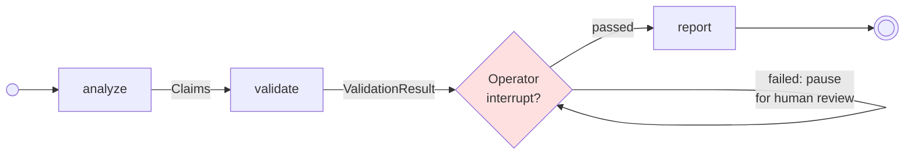

Some pipelines can't run end-to-end without a human in the loop. A validation step finds a problem and needs review. An output is generated but must be approved before side effects. A privileged operation requires confirmation.

NeoGraph makes this a one-line addition: pass `interrupt_when=` to `@node`. When the condition returns a truthy value, the graph pauses via LangGraph's `interrupt()` mechanism, checkpoints its state, and waits. Resume with `run(graph, resume={...}, config=config)`.

:::note[Two kinds of pause: node-boundary vs mid-loop]
`interrupt_when=` evaluates *between* nodes, on a node's completed output — use it to review a node's finished result. To pause **inside** an `agent`/`act` node's tool loop — a tool that stops to ask a human before it decides — use [`ask_human()`](#mid-loop-pauses-inside-an-agentact-tool-loop) (or raw LangGraph `interrupt()`) from within the tool body. Both are supported; they cover different moments.
:::

## The graph



The `Operator` modifier adds an interrupt checkpoint after `validate`. If the condition returns truthy, the graph pauses. Resume with `run(graph, resume={...})` to continue.

## The scenario

A pipeline analyzes a set of requirements and checks whether coverage meets a quality bar. If it doesn't, a human must review the gaps before the final report is generated.

```python
from __future__ import annotations

import sys
from langgraph.checkpoint.memory import MemorySaver
from pydantic import BaseModel

from neograph import compile, construct_from_module, node, run


# ── Schemas ──

class Analysis(BaseModel, frozen=True):
    claims: list[str]
    coverage_pct: int

class ValidationResult(BaseModel, frozen=True):
    passed: bool
    issues: list[str]

class FinalReport(BaseModel, frozen=True):
    text: str


# ── Pipeline ──

@node(outputs=Analysis)
def analyze() -> Analysis:
    return Analysis(claims=["auth", "logging", "encryption"], coverage_pct=55)


@node(
    outputs=ValidationResult,
    interrupt_when=lambda state: (
        {"issues": state.check.issues, "message": "Please review and approve"}
        if state.check and not state.check.passed
        else None
    ),
)
def check(analyze: Analysis) -> ValidationResult:
    if analyze.coverage_pct < 80:
        return ValidationResult(
            passed=False,
            issues=[f"Coverage {analyze.coverage_pct}% is below 80% threshold"],
        )
    return ValidationResult(passed=True, issues=[])


@node(outputs=FinalReport)
def report(analyze: Analysis) -> FinalReport:
    return FinalReport(
        text=f"Report: {analyze.claims}, coverage: {analyze.coverage_pct}%"
    )


pipeline = construct_from_module(sys.modules[__name__], name="review-pipeline")
```

## The `interrupt_when` kwarg

`interrupt_when` accepts either a callable or a registered condition name:

- **Callable (inline)**: `interrupt_when=lambda state: payload_or_none`. The function receives the full pipeline state and returns either `None` (continue) or a dict (pause, with the dict as the interrupt payload).
- **String (registered)**: `interrupt_when='condition_name'`. The name must be supplied to `compile()` via the `conditions=` kwarg: `compile(pipeline, conditions={'condition_name': lambda state: ...})`.

The inline form is usually cleaner. When the condition returns a dict, the graph pauses and LangGraph's `interrupt()` fires with that payload as the reason.

## Running with a checkpointer

Interrupt/resume requires a checkpointer — LangGraph needs somewhere to persist state between the pause and the resume. The compiler enforces this: calling `compile(pipeline)` on a pipeline with `interrupt_when` and no checkpointer raises an error.

```python
from langgraph.checkpoint.memory import MemorySaver

graph = compile(pipeline, checkpointer=MemorySaver())

# thread_id identifies this execution for later resume
config = {"configurable": {"thread_id": "review-001"}}
```

`MemorySaver` is fine for development. For production, use `SqliteSaver`, `PostgresSaver`, or any LangGraph-compatible checkpointer.

## First run — pauses

```python
result = run(graph, input={"node_id": "REQ-001"}, config=config)

if "__interrupt__" in result:
    interrupt_data = result["__interrupt__"]
    for interrupt in interrupt_data:
        print(f"Paused: {interrupt.value}")
        # Paused: {'issues': ['Coverage 55% is below 80% threshold'],
        #          'message': 'Please review and approve'}
```

When the graph pauses, `run()` returns with the partial state plus an `__interrupt__` key containing the interrupt payloads. Everything up to the pause point is already in the checkpoint — `analyze` ran, `check` ran and produced a failing `ValidationResult`, then the interrupt fired.

## Resume with human feedback

```python
result = run(graph, resume={"approved": True, "reviewer": "alice"}, config=config)

print(result["human_feedback"])   # {'approved': True, 'reviewer': 'alice'}
print(result["report"].text)      # The report ran after the resume
```

Calling `run()` with `resume=` instead of `input=` continues the paused graph. The `resume` dict is stored in `state.human_feedback` so downstream nodes can read the decision. The graph then continues from `check` onward — `report` runs, and you get the final state.

## When the condition is falsy

If `analyze.coverage_pct` had been 85% instead of 55%, `check` would return `passed=True`, the lambda would return `None`, and the interrupt would never fire. The graph runs straight through to `report` as if `interrupt_when` weren't there.

## Why not Operator directly?

The `Operator` modifier still exists for [runtime construction](/runtime/programmatic/). For pipelines written with `@node`, `interrupt_when=` is the cleaner path — the condition lambda is co-located with the node it guards, and the graph wiring happens automatically at `construct_from_module` time.

## Mid-loop pauses: inside an `agent`/`act` tool loop

`interrupt_when=` pauses at node boundaries. But an `agent`/`act` node runs a ReAct loop — many tool calls inside one node — and sometimes a *tool itself* needs to stop and ask a human before it can decide. `ask_human()` is the blessed path for that: call it from inside a tool body.

```python
from pydantic import BaseModel
from neograph import ask_human


class ReviewRequest(BaseModel):
    question: str
    candidate: str

class Decision(BaseModel):
    approved: bool
    note: str


class DecideTool:
    name = "decide"

    def invoke(self, args: dict) -> str:
        # Pause the tool loop and ask a human. The graph checkpoints here.
        decision = ask_human(
            ReviewRequest(question="Approve this candidate?", candidate=args["name"]),
            resume_model=Decision,
        )
        # After resume, `decision` is a validated Decision instance.
        return f"approved={decision.approved}: {decision.note}"

    async def ainvoke(self, *a, **k) -> str:
        return self.invoke(*a, **k)
```

The payload surfaces exactly like any other interrupt — `result["__interrupt__"][0].value` holds `payload.model_dump()`. Resume the graph the same way:

```python
result = run(graph, resume={"approved": True, "note": "looks good"}, config=config)
```

When you pass `resume_model=`, the resumed dict is **validated** into that model before your tool sees it — a malformed answer raises `pydantic.ValidationError` at the `ask_human()` call, not deep inside your tool. Omit `resume_model=` to receive the raw resume value unchanged.

`ask_human()` is pure, optional sugar: it adds the typed contract and makes the pause a marker the [linter](/runtime/lint/) can see. It contains **zero** execution logic — the pause/resume path is byte-identical to calling LangGraph's `interrupt()` directly, which **remains fully supported**. Use whichever you prefer:

```python
from langgraph.types import interrupt

# Raw path — no typed contract, but works identically.
answer = interrupt({"question": "Approve this candidate?"})
```

:::caution[Idempotency at node granularity]
LangGraph checkpoints and replays at **node** granularity. In a ReAct loop, a non-idempotent side effect performed *before* an `ask_human()` pause in the same node can **double-fire** on resume. Keep any mutation before the pause idempotent, or move it after. The linter warns (`ask_human_in_mutating_node`) when it sees `ask_human()` reachable from an `act`-mode (mutating) node — a nudge to check this ordering.
:::

## Key takeaways

- `interrupt_when=` pauses the graph when the condition returns a truthy payload
- `ask_human()` pauses *inside* an `agent`/`act` tool loop, with an optional typed resume contract
- Inline lambdas are cleaner than registered conditions for most cases
- A checkpointer is required — `MemorySaver` for dev, persistent savers for prod
- `run(resume={...}, config=config)` continues from the checkpoint
- The resume payload lands in `state.human_feedback`

---

Documentation © 2025-2026 Constantine Mirin, [mirin.pro](https://mirin.pro). Licensed under [CC BY-ND 4.0](https://creativecommons.org/licenses/by-nd/4.0/).
