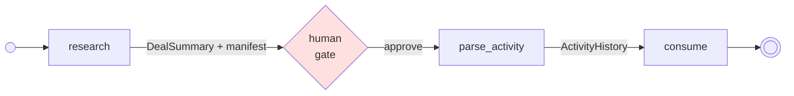

An agent that pastes a 40-message email history into its context burns tokens on every turn and drags the whole corpus through every checkpoint. The Model Context Protocol has a better shape: a tool returns a `resource_link` — a small typed *reference* — and the bytes are fetched later, only by the node that needs them, only for the fraction it needs.

neograph names this pattern **Typed Resource Manifest with Ephemeral Hydration**. It is worth naming because the field has not: the protocol formally supports acquire-now / hydrate-later (`resource_link` is a first-class tool-result block) but deliberately specifies nothing about lifetime, discoverability, or partial reads. The closest published precedents — Google ADK's references-in-state + always-re-fetch, LangGraph's checkpointed-state-for-HITL split, the Frees "links are artifacts of tool invocations" paper — all converge on the same three moves neograph makes: typed references in checkpointed state, ephemeral on-demand hydration, and re-derive-by-replay rather than materialize.

This walkthrough follows `examples/24_mcp_resources_from_resource.py`, a CRM deal-research pipeline talking to a **real** MCP server (a plain FastMCP server spawned as a stdio subprocess). The MCP layer is genuine end-to-end; the only fakes are the LLMs, so it runs with no API keys and no network beyond the local subprocess. The pause and resume ride a real file-backed `AsyncSqliteSaver`, so the manifest survives an actual checkpoint.

## The shape



`research` is an agent: it calls `get_deal` (whose result carries `resource_link` blocks) and `read_emails` (a typed fraction query). `gate` pauses for a human. On resume, `parse_activity` hydrates one corpus by templated URI and `consume` hydrates another from the manifest — and self-heals a link that died during the pause.

## Beat 1 — typed domain readers, not blob reads

The naive MCP read is `read_resource(uri) -> bytes`: the model gets an opaque blob and has to hope it can parse it. `resource_reader` replaces that with a typed tool — a URI template plus an output model:

{/* test-skip: illustrative fragment: references `EmailPage` defined in the page narrative, not in a runnable block */}
```python
from neograph import resource_reader

read_emails = resource_reader(
    "read_emails",
    uri_template="mcp://crm/deals/{deal_id}/emails/{start}/{end}",
    output_model=EmailPage,
    description="Read a date-range fraction of a deal's email history.",
    idempotent=True,   # read-only -> replay-safe
)
```

The tool's argument schema is derived from the template's RFC 6570 variables, so the agent supplies `deal_id`, `start`, `end` as typed parameters and gets back a validated `EmailPage` — a date-range **fraction** of the corpus, not the whole thing. The parsed model flows through `ToolInteraction.typed_result`, never a repr string. The date range rides as **path segments** (`/emails/{start}/{end}`) because plain FastMCP's `@mcp.resource` cannot express an RFC 6570 query template (`emails{?from,to}`) — see the appendix.

## Beat 2 — the manifest: references on the bus, blobs never

The research agent also calls `get_deal`, whose result carries two `resource_link` blocks (activity history, email history). neograph lifts each one into a typed `ResourceRef` and parks it in a **checkpointed** state channel — the manifest. You can read it straight off the bus:

{/* test-skip: top-level await/async snippet (not runnable as a plain module) */}
```python
state = await graph.aget_state(config)
manifest = state.values["neo_resource_manifest_research"]
for ref in manifest:
    print(ref.kind, ref.uri, ref.producing_call.tool_name)
# activity-history  mcp://crm/deals/D1/activity            get_deal
# email-history     mcp://crm/deals/D1/emails/...          get_deal
```

Each `ResourceRef` carries its `uri`, a domain `kind`, the `server` (for fetcher routing), and — critically — its `producing_call`: the exact `(tool_name, args)` that emitted the link, plus whether that producer is idempotent. That provenance is what makes an expired reference recoverable. The manifest channel is `neo_`-prefixed, so it is stripped from user-facing `run()` output but preserved in the checkpoint — exactly the tier LangGraph designates for anything that must survive a human pause.

:::note[Preserving raw resource_link blocks]
langchain-mcp-adapters rewrites `resource_link` blocks to `type: "file"`, which the manifest lift does not recognise, and a raw block's `uri` is a pydantic `AnyUrl` the lift cannot scan. The example's `get_deal` tool therefore round-trips the raw MCP session and returns blocks as dicts with **string** uris — the same reason the shipped resource *replayer* uses the raw session (see `neograph_mcp._client`).
:::

## Beat 3 — `FromResource` across two node shapes

`FromResource` is dependency injection: the *framework* fetches and parses a resource at node entry, before your function runs. It resolves through the consumer-supplied fetcher (`config["configurable"]["mcp_resource_fetcher"]`), and because the read is awaited, a `FromResource` node is `async` and driven by `arun()`. It has two faces, and the example uses both.

**A deterministic node, by templated URI.** When the URI shape is known at author time, hydrate it directly. The template variables interpolate from the node's `FromInput` values:

{/* test-skip: illustrative fragment: references `node` defined in the page narrative, not in a runnable block */}
```python
@node(outputs=ActivityHistory)
async def parse_activity(
    gate: GateAck,
    deal_id: Annotated[str, FromInput],
    activity: Annotated[ActivityHistory, FromResource(uri="mcp://crm/deals/{deal_id}/activity")],
) -> ActivityHistory:
    return activity   # already fetched + parsed into ActivityHistory
```

**A think node, from the manifest.** When an upstream agent discovered the resource at runtime, you do not know the URI at author time — the manifest does. Hydrate by `kind`, and the fetched history flows straight into the prompt:

{/* test-skip: illustrative fragment: references `node` defined in the page narrative, not in a runnable block */}
```python
@node(mode="think", outputs=Brief, model="consume", prompt="consume/brief")
async def consume(
    parse_activity: ActivityHistory,
    history: Annotated[EmailHistory, FromResource(ref="email-history", max_bytes=200_000)],
) -> Brief: ...
```

The think node's body never runs — but `history` still reaches the prompt, because the async di-inputs path awaits the fetch before the prompt is compiled and hands the parsed model to the prompt compiler. `max_bytes` caps the fetch at node entry, so an oversized corpus fails loud with a clear message instead of a confusing provider 400 once the text hits the model.

(The sync `run()` driver fails loud on any `FromResource` binding — the fetch is awaited, so there is nothing to resolve synchronously. Drive it with `arun()`.)

## Beat 4 — self-healing hydration across the pause

A `resource_link` carries no lifetime contract: the URI a tool returned before a human pause may already be dead when the pause ends. The example makes that concrete — it arms a one-shot expiry on the email-history resource **during** the gate pause, then resumes:

{/* test-skip: top-level await/async snippet (not runnable as a plain module) */}
```python
# during the pause:
await arm_email_expiry()          # the link the resume needs now dies once
result = await arun(graph, resume={"approved": True}, config=config)
```

On resume, `consume` tries to hydrate `email-history`. The read fails — and neograph's layered expiry takes over:

1. **Read** `ref.uri`. It fails (the armed expiry fired).
2. **Replay.** The only protocol-reliable way to re-derive a lifetime-free link is to re-invoke the call that produced it. neograph replays `ref.producing_call` through the consumer's *replayer* and reads the re-derived link. This is gated on the producer's idempotency — a read may replay, a mutation may not; a non-idempotent producer refuses with `NonIdempotentReplayError` rather than risk a double side effect. `get_deal` is marked `idempotent=True`, so the gate is satisfied.
3. **Fail loud** with `ResourceExpiredError` only if no replayer is configured or the replay itself fails. Silent staleness is worse than a loud failure.

The heal fires on **any** read failure, not a specific error code. Plain FastMCP's decorator swallows JSON-RPC error codes — an expired resource surfaces as a generic `code: 0`, not a hand-crafted `-32002` — and the heal works regardless, because `hydrate_resource_ref` treats any fetch failure as candidate expiry (the idempotency gate makes that safe). That robustness *is* the feature; the demo proves it with the error a real FastMCP server actually produces.

### The featured wiring: the shipped battery

The fetcher and replayer come from the `neograph[mcp]` battery — one call, dropped into config:

{/* test-skip: illustrative fragment: references `sys` defined in the page narrative, not in a runnable block */}
```python
from neograph_mcp import StdioServer, mcp_resource_fetcher

server = StdioServer(command=sys.executable, args=[DEMO_SERVER])
fetcher, replayer = mcp_resource_fetcher({"crm": server})

config = {"configurable": {
    "mcp_resource_fetcher": fetcher,
    "mcp_resource_replayer": replayer,
}}
```

The replayer maps a `producing_call` back through the same client, so self-healing works out of the box. A consumer with house rules can hand-roll either callable — an `async fetch(uri) -> (content, mime)` and an `async replay(tool_name, args) -> raw_result` — as the escape hatch; the battery is only the default.

## Beat 5 — the per-run fetch cache

A ref read twice within one run should hit the server once. neograph caches an awaited `FromResource` fetch on the framework-minted **run id** — a config-only key, stable across every superstep of one run, re-minted fresh on resume. So the cache is invalidate-on-resume *by construction*: a fresh run id after the pause forces a re-fetch, which is exactly what you want — a resume must not serve a value fetched before the pause. The example prints its per-run fetch counts to make the boundary visible.

## Appendix — the server side: template-capable resources

The demo server is **plain FastMCP** on purpose: a demo gets copied, and every workaround line gets copied too. Two SDK gaps (verified against `mcp` 1.28.x) are handled by design rather than low-level handlers:

- **Query templates are inexpressible in `@mcp.resource`.** FastMCP extracts URI parameters with a simple `{name}` regex and anchors the read match, so an RFC 6570 query fraction like `emails{?from,to}` never parses. The demo expresses the date-range fraction as **path segments** — `emails/{start}/{end}` — which `@mcp.resource` supports natively and which neograph's client-side RFC 6570 expansion interpolates without special-casing.
- **The decorator swallows JSON-RPC error codes.** A resource handler's exception reaches the client as a generic `code: 0`, so a decorator-based resource cannot emit a real `-32002`. The demo does not forge one; neograph's heal is code-agnostic (beat 4).

If you *do* control a server and want a genuine query-template resource or a specific `-32002`, drop to a low-level `read_resource` handler on the underlying `mcp._mcp_server` that parses the query string by hand and raises `McpError(ErrorData(code=-32002, ...))`. That is more machinery than most servers need — hence the plain-FastMCP default — but it is the recipe when you need it.

## Key takeaways

- **Typed Resource Manifest with Ephemeral Hydration**: references travel on a checkpointed bus; blobs are fetched on demand, by the one node that needs them.
- `resource_reader` gives the *model* a typed fraction query; `FromResource` gives the *framework* a typed fetch at node entry — by templated URI or by manifest `kind`.
- A `ResourceRef` carries its producing call, so an expired link re-derives by replay — gated on idempotency, failing loud if it cannot.
- The `neograph[mcp]` battery's `(fetcher, replayer)` make self-healing hydration work out of the box.
- Everything is real MCP over stdio, offline, keyless — only the LLMs are faked.

See also the [Resource Hydration reference](/concepts/resource-hydration/) for the full `FromResource` surface (static and templated URIs, size caps, lint checks) and the [MCP Client walkthrough](/walkthrough/mcp-client/) for the tool-side battery.

---

Documentation &copy; 2025-2026 Constantine Mirin, [mirin.pro](https://mirin.pro). Licensed under [CC BY-ND 4.0](https://creativecommons.org/licenses/by-nd/4.0/).
