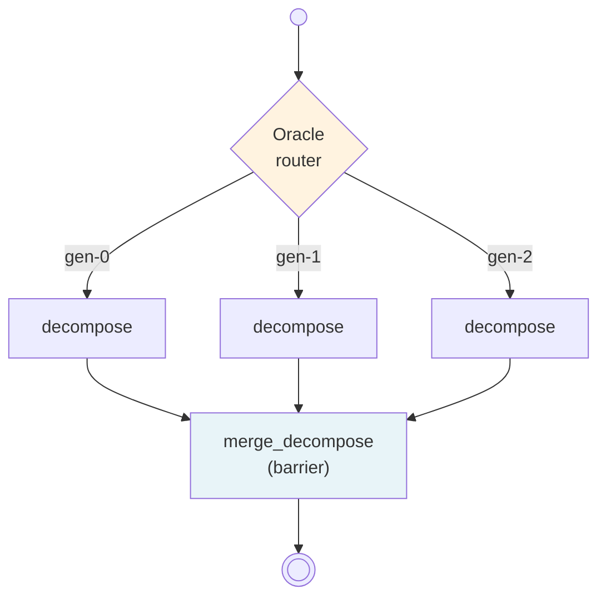

An Oracle runs the same node multiple times in parallel -- each instance gets a unique generator ID so it can produce a different perspective. A merge step combines the results into a single consensus output.

This is the ensemble pattern: multiple independent attempts at the same task, deduplicated or judged into one answer.

With `@node`, the Oracle modifier is applied via kwargs: `ensemble_n=` and `merge_fn=` on the decorator. No `|` pipe operator needed.

## The graph



The Oracle modifier expands a single node into N parallel generators + a merge barrier. Each generator runs independently. The merge function combines N results into one.

## What you will learn

- Applying the Oracle modifier via `@node` kwargs (`ensemble_n=`, `merge_fn=`)
- Supplying a scripted merge function via the `scripted=` kwarg on `compile()`
- Thread-safe generation across parallel instances
- How the compiler expands Oracle into fan-out + barrier + merge

## Schemas

```python
from pydantic import BaseModel

class Topic(BaseModel, frozen=True):
    text: str

class Claims(BaseModel, frozen=True):
    items: list[str]
```

## The Oracle node

Adding `ensemble_n=3` and `merge_fn="merge_claims"` to `@node` tells the compiler to run this node 3 times in parallel, then merge the results:

```python
from neograph import node

@node(outputs=Claims, ensemble_n=3, merge_fn="merge_claims")
def decompose() -> Claims:
    with _gen_counter_lock:
        idx = _gen_counter[0] % len(_perspectives)
        _gen_counter[0] += 1
    return Claims(items=_perspectives[idx])
```

Each parallel instance calls the same function. A thread-safe counter rotates through perspectives so each generator returns different claims.

## The merge function

The merge function receives a list of all generator outputs and combines them:

```python
def merge_claims(variants, config):
    """Merge N claim lists into one deduplicated list."""
    seen = set()
    merged = []
    for variant in variants:
        for claim in variant.items:
            if claim not in seen:
                seen.add(claim)
                merged.append(claim)
    return Claims(items=merged)
```

`variants` is `[Claims, Claims, Claims]` -- one per generator. The merge deduplicates by claim text. The function is wired to the `merge_fn="merge_claims"` reference by passing `scripted={"merge_claims": merge_claims}` to `compile()` (see the complete pipeline below).

## The complete pipeline

```python
"""Oracle Ensemble: 3 parallel generators + scripted merge.

Run:
    python 03_oracle_ensemble.py
"""

from __future__ import annotations

import sys
import threading

from pydantic import BaseModel

from neograph import compile, construct_from_module, node, run


# -- Schemas ----------------------------------------------------------------

class Topic(BaseModel, frozen=True):
    text: str

class Claims(BaseModel, frozen=True):
    items: list[str]


# -- Generator perspectives -------------------------------------------------

_perspectives = [
    ["security: must authenticate", "security: must encrypt"],
    ["reliability: must handle failures", "reliability: must log errors"],
    ["performance: must respond in 200ms", "security: must authenticate"],
]

_gen_counter_lock = threading.Lock()
_gen_counter = [0]


# -- Merge: combine and deduplicate claims from all generators --------------

def merge_claims(variants, config):
    """Merge N claim lists into one deduplicated list."""
    seen = set()
    merged = []
    for variant in variants:
        for claim in variant.items:
            if claim not in seen:
                seen.add(claim)
                merged.append(claim)
    return Claims(items=merged)


# -- Build pipeline ---------------------------------------------------------

@node(outputs=Claims, ensemble_n=3, merge_fn="merge_claims")
def decompose() -> Claims:
    with _gen_counter_lock:
        idx = _gen_counter[0] % len(_perspectives)
        _gen_counter[0] += 1
    return Claims(items=_perspectives[idx])


pipeline = construct_from_module(sys.modules[__name__], name="oracle-demo")


# -- Run --------------------------------------------------------------------

if __name__ == "__main__":
    _gen_counter[0] = 0  # reset for clean run
    graph = compile(pipeline, scripted={"merge_claims": merge_claims})
    result = run(graph, input={"node_id": "REQ-001"})

    merged = result["decompose"]
    print(f"3 generators produced {len(merged.items)} unique claims:")
    for claim in merged.items:
        print(f"  - {claim}")
    # "security: must authenticate" appears in gen-0 and gen-2 but is deduplicated
```

## Expected output

```
3 generators produced 5 unique claims:
  - security: must authenticate
  - security: must encrypt
  - reliability: must handle failures
  - reliability: must log errors
  - performance: must respond in 200ms
```

Note that "security: must authenticate" appears in both gen-0 and gen-2, but the merge function deduplicates it.

## @node kwargs vs the `|` pipe operator

The `@node` decorator accepts Oracle kwargs directly:

```python
# @node style (this walkthrough)
@node(outputs=Claims, ensemble_n=3, merge_fn="merge_claims")
def decompose() -> Claims: ...
```

This is equivalent to the pipe-operator style used in the Runtime/IR API:

{/* test-skip: illustrative fragment: references `Node` defined in the page narrative, not in a runnable block */}
```python
# Pipe style (programmatic API)
decompose = Node.scripted("decompose", fn="generate", outputs=Claims) | Oracle(n=3, merge_fn="merge_claims")
```

Both compile to the same topology. Use `@node` kwargs when writing pipelines as modules. Use the pipe operator when building pipelines programmatically.

## Scripted merge vs LLM merge

Oracle requires exactly one of `merge_fn` or `merge_prompt`.

### Scripted merge (deterministic)

```python
@node(outputs=Claims, ensemble_n=3, merge_fn="merge_claims")
def decompose() -> Claims: ...
```

Use scripted merge when the combination logic is straightforward (deduplication, union, voting).

### LLM merge (judge)

{/* test-skip: BROKEN doc snippet (API drift): node() got an unexpected keyword argument 'merge_model'; see verifiable-docs follow-up bead */}
```python
@node(outputs=Claims, prompt="decompose", model="reason",
      ensemble_n=3, merge_prompt="rw/decompose-merge", merge_model="reason")
def decompose() -> Claims: ...
```

The framework passes all generator outputs to an LLM with the given prompt template. The LLM produces the final merged result as structured output. Use this when merging requires judgment (picking the best analysis, synthesizing contradictory results).

### Merge hooks

The `merge_prompt` path supports optional hooks that bracket the LLM call. These let you customize the merge without dropping down to `@merge_fn` and losing NeoGraph's built-in LLM dispatch (retry, rendering, schema enforcement).

{/* test-skip: illustrative fragment: references `GroupingResult` defined in the page narrative, not in a runnable block */}
```python
@node(outputs=GroupingResult, prompt="decompose", model="reason",
      ensemble_n=3, merge_prompt="rw/group-claims",
      merge_pre_process=tag_with_gen_ids,
      merge_post_process=ensure_all_grouped,
      merge_fallback=singleton_fallback)
def decompose() -> GroupingResult: ...
```

- **`merge_pre_process(variants) -> dict`** -- transform raw variants into custom input_data for the merge prompt. Replaces the default `{"variants": [...], **upstream}` entirely.
- **`merge_post_process(result, variants) -> result`** -- transform the parsed LLM output before it is written to state (e.g., self-healing invariants, ID remapping). Only runs on LLM success.
- **`merge_fallback(variants, error) -> result`** -- catch LLM/parse errors and return a deterministic result (e.g., treat each variant as its own group).

All three are optional and only valid with `merge_prompt`. Passing any hook with `merge_fn` raises `ConfigurationError`.

## Multi-model ensemble with models=

Instead of running the same model N times, run different models on the same input. Each generator gets a different model tier:

```python
from neograph import Node, Construct, Oracle, compile, run

def gen(input_data, config):
    model = config.get("configurable", {}).get("_oracle_model", "default")
    return Claims(items=[f"claim-from-{model}"])

def pick_best(variants, config):
    # In production: score variants, pick highest quality
    all_items = []
    for v in variants:
        all_items.extend(v.items)
    return Claims(items=all_items)

gen_node = (
    Node.scripted("gen", fn="multi_gen", outputs=Claims)
    | Oracle(models=["reason", "fast", "creative"], merge_fn="pick_best")
)
pipeline = Construct("multi-model", nodes=[gen_node])
graph = compile(pipeline, scripted={"multi_gen": gen, "pick_best": pick_best})
result = run(graph, input={"node_id": "REQ-001"})
# result["gen"].items = ["claim-from-reason", "claim-from-fast", "claim-from-creative"]
```

When `models=` is set:
- `n` is inferred from `len(models)` unless explicitly overridden
- Each generator sees its model tier via `config["configurable"]["_oracle_model"]`
- For redundancy, set both: `Oracle(n=9, models=["reason", "fast", "creative"], ...)` distributes round-robin (3 each)
- If `n % len(models) != 0`, uneven distribution is logged as info

The `@node` decorator equivalent:

```python
@node(outputs=Claims, models=["reason", "fast", "creative"], merge_fn="pick_best")
def decompose() -> Claims: ...
```

### Body-as-merge

When `models=` is set without `merge_fn` or `merge_prompt`, the function body IS the merge:

{/* test-skip: illustrative fragment: references `Input` defined in the page narrative, not in a runnable block */}
```python
@node(outputs=Claims, models=["reason", "fast", "creative"])
def decompose(data: Input) -> Claims:
    # Body receives list[Claims] at runtime (one per model)
    return max(data, key=lambda v: len(v.items))
```

One definition captures the entire ensemble: prompt (via the node), models, and merge logic.

## What the compiler generates

When it encounters `ensemble_n=3, merge_fn="merge_claims"`, the compiler expands the single node into:

1. **Fan-out router** -- dispatches 3 parallel `Send()` calls to the generator node, each with a different `neo_oracle_gen_id`
2. **Generator node** -- runs 3 times in parallel, writes to a collector field with a list reducer
3. **Merge barrier** (`defer=True`) -- waits for all 3 generators to complete, then runs the merge function
4. **Consumer field** -- the merged result is written to `state.decompose` (the node's name), not the collector

You never see this expansion. You write one `@node` with `ensemble_n=` and get the full topology.

## Real-world pattern: generate + evaluate in 10 lines

The most powerful Oracle pattern combines LLM generation with LLM evaluation and domain hooks. This replaces 60+ lines of manual `@merge_fn` code that calls LLMs directly.

{/* test-skip: illustrative fragment: references `ProductDescription` defined in the page narrative, not in a runnable block */}
```python
from neograph import node, construct_from_module, compile, run

# Domain hooks -- the only custom logic you write:

def tag_variants(variants: list[ProductDescription]) -> dict:
    """Number variants so the judge can reference them."""
    tagged = [f"[{i+1}] {v.headline}: {v.body}" for i, v in enumerate(variants)]
    return {"numbered_variants": "\n".join(tagged)}

def ensure_cta(result: ProductDescription, variants: list[ProductDescription]) -> ProductDescription:
    """Self-healing: if the judge omitted the CTA, pull one from a variant."""
    if not result.cta:
        for v in variants:
            if v.cta:
                return result.model_copy(update={"cta": v.cta})
    return result

def fallback(variants: list[ProductDescription], error: Exception) -> ProductDescription:
    """On LLM failure, pick the variant with the longest body."""
    return max(variants, key=lambda v: len(v.body))

# The pipeline -- generate + evaluate + self-heal:

@node(outputs=ProductDescription,
      prompt="write-product-description",
      model="fast",
      ensemble_n=3,
      merge_prompt="rw/pick-best-description",
      merge_pre_process=tag_variants,
      merge_post_process=ensure_cta,
      merge_fallback=fallback)
def write_description() -> ProductDescription: ...
```

What NeoGraph gives you for free on the merge LLM call:

- BAML rendering of the variant list (typed, structured, LLM-friendly)
- Schema injection into the system message
- `invoke_structured` with retry-on-error-feedback (up to 2 retries -- the LLM sees its own validation failure each time)
- JSON repair for malformed output
- Null-to-default coercion
- Cost tracking via configured callbacks
- Langfuse/LangSmith spans via configured callbacks
- Structured logging of duration and tokens

Your hooks handle only the domain logic: what the judge should see (`pre_process`), what invariants to enforce (`post_process`), and what to do when the LLM fails (`fallback`).

See `examples/20_oracle_merge_hooks.py` for a complete runnable version.

---

Documentation &copy; 2025-2026 Constantine Mirin, [mirin.pro](https://mirin.pro). Licensed under [CC BY-ND 4.0](https://creativecommons.org/licenses/by-nd/4.0/).
