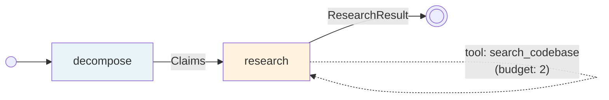

This walkthrough introduces NeoGraph's two primary LLM modes: **think** (single structured call) and **agent** (ReAct tool loop with budget enforcement). Together they form the most common two-step pattern: decompose a problem, then research it.

The pipeline is built with `@node`-decorated functions and `construct_from_module`. Mode is inferred from the kwargs: `prompt=` + `model=` means LLM call. Add `tools=` and it becomes an agent loop.

The example uses fake LLM and tool implementations so you can run it without API keys. Replace them with real ones for production.

## The graph



`decompose` is a **think** node (single LLM call). `research` is an **agent** node (ReAct tool loop with budget). The dotted self-edge represents the tool-calling cycle inside the agent.

## What you will learn

- Configuring the LLM layer via `compile()` kwargs (`llm_factory=`, `prompt_compiler=`)
- Using `@node` with `prompt=` and `model=` for LLM think mode
- Using `@node` with `mode="agent"` and `tools=` for ReAct tool loops
- Declaring tools with `Tool(name, budget)`
- Supplying tool factories via the `tool_factories=` kwarg on `compile()`
- Parameter-name wiring between LLM nodes

## Schemas

```python
from pydantic import BaseModel

class Requirement(BaseModel, frozen=True):
    text: str

class Claims(BaseModel, frozen=True):
    items: list[str]

class ResearchResult(BaseModel, frozen=True):
    findings: list[dict[str, str]]
```

## Nodes

The `decompose` node has `prompt=` and `model=` but no `mode=` -- NeoGraph infers `mode="think"` (single LLM call, structured output). The function body is `...` because the LLM handles execution.

The `research` node explicitly sets `mode="agent"` and adds `tools=`. It runs a ReAct loop: call the LLM, execute tool calls, feed results back, repeat until the budget is exhausted.

```python
from neograph import node, Tool

@node(outputs=Claims, model="fast", prompt="req/decompose")
def decompose() -> Claims:
    ...


@node(
    mode="agent",
    outputs=ResearchResult,
    model="reason",
    prompt="req/research",
    tools=[Tool(name="search_codebase", budget=2)],
)
def research(decompose: Claims) -> ResearchResult:
    ...
```

The parameter name `decompose` on `research` wires it to the upstream `decompose` node.

## The complete pipeline

{/* test-skip: BROKEN doc snippet (API drift): FakeSearchTool.invoke() got an unexpected keyword argument 'config'; see verifiable-docs follow-up bead */}
```python
"""Think + Agent: decompose a requirement, then research with tools.

Run:
    python 02_produce_and_gather.py
"""

from __future__ import annotations

import sys

from langchain_core.messages import AIMessage
from pydantic import BaseModel

from neograph import Tool, compile, construct_from_module, node, run


# -- Schemas ----------------------------------------------------------------

class Requirement(BaseModel, frozen=True):
    text: str

class Claims(BaseModel, frozen=True):
    items: list[str]

class ResearchResult(BaseModel, frozen=True):
    findings: list[dict[str, str]]


# -- Fake LLM (replace with real OpenRouter/OpenAI in production) -----------

class FakeDecomposeLLM:
    """Simulates an LLM that decomposes a requirement into claims."""
    def with_structured_output(self, model):
        self._model = model
        return self

    def invoke(self, messages, **kwargs):
        return self._model(items=[
            "system shall authenticate users",
            "system shall log failed attempts",
            "system shall rate-limit login",
        ])


class FakeResearchLLM:
    """Simulates an LLM that calls a search tool, then responds."""
    def __init__(self):
        self._call_count = 0

    def bind_tools(self, tools):
        clone = FakeResearchLLM()
        clone._call_count = self._call_count
        clone._has_tools = len(tools) > 0
        return clone

    def invoke(self, messages, **kwargs):
        self._call_count += 1
        if getattr(self, "_has_tools", True) and self._call_count <= 3:
            msg = AIMessage(content="")
            msg.tool_calls = [{
                "name": "search_codebase",
                "args": {"query": f"claim-{self._call_count}"},
                "id": f"call-{self._call_count}",
            }]
            return msg
        return AIMessage(content="research complete")

    def with_structured_output(self, model):
        self._model = model
        return self


# -- Fake tool --------------------------------------------------------------

search_count = {"n": 0}

class FakeSearchTool:
    name = "search_codebase"

    def invoke(self, args):
        search_count["n"] += 1
        return f"Found 3 references for: {args.get('query', '?')}"


# -- Configure LLM layer ---------------------------------------------------

def llm_factory(tier):
    if tier == "fast":
        return FakeDecomposeLLM()
    return FakeResearchLLM()


# -- Pipeline nodes ---------------------------------------------------------

@node(outputs=Claims, model="fast", prompt="req/decompose")
def decompose() -> Claims:
    ...


@node(
    mode="agent",
    outputs=ResearchResult,
    model="reason",
    prompt="req/research",
    tools=[Tool(name="search_codebase", budget=2)],
)
def research(decompose: Claims) -> ResearchResult:
    ...


pipeline = construct_from_module(sys.modules[__name__], name="requirement-analysis")


# -- Run --------------------------------------------------------------------

if __name__ == "__main__":
    graph = compile(
        pipeline,
        llm_factory=llm_factory,
        prompt_compiler=lambda template, data: [{"role": "user", "content": "analyze"}],
        tool_factories={"search_codebase": lambda config, tool_config: FakeSearchTool()},
    )
    result = run(graph, input={"node_id": "REQ-042"})

    print(f"Decomposed into {len(result['decompose'].items)} claims:")
    for claim in result["decompose"].items:
        print(f"  - {claim}")

    print(f"\nSearch tool called {search_count['n']} times (budget was 2)")
    print(f"Research complete: {result['research'] is not None}")
```

## Expected output

```
Decomposed into 3 claims:
  - system shall authenticate users
  - system shall log failed attempts
  - system shall rate-limit login

Search tool called 2 times (budget was 2)
Research complete: True
```

## Mode inference

NeoGraph infers the execution mode from the kwargs you pass to `@node`:

| Present kwargs | Inferred mode | Behavior |
|---|---|---|
| `prompt=` + `model=` | `think` | Single LLM call, structured JSON output |
| `prompt=` + `model=` + `tools=` | `agent` | ReAct tool loop |
| Neither | `scripted` | Function body runs as-is |

You can also set `mode=` explicitly, which is required for `agent` if you want to be explicit about the distinction from `think`.

## Think mode

A **think** node makes a single LLM call and expects structured JSON back. The framework calls `llm.with_structured_output(output_model)` and parses the response into your Pydantic schema automatically.

```python
@node(outputs=Claims, model="fast", prompt="req/decompose")
def decompose() -> Claims:
    ...
```

No tool loop. No message history management. One call, one typed result.

## Agent mode

An **agent** node runs a ReAct loop: call the LLM, if it requests tool calls execute them, feed results back, repeat. The loop continues until the LLM responds without tool calls, or all tool budgets are exhausted.

```python
@node(
    mode="agent",
    outputs=ResearchResult,
    model="reason",
    prompt="req/research",
    tools=[Tool(name="search_codebase", budget=2)],
)
def research(decompose: Claims) -> ResearchResult:
    ...
```

### Tool budget enforcement

Each `Tool` has a `budget` -- the maximum number of calls allowed. When a tool's budget is exhausted, the framework removes it from the LLM's available tools. When all budgeted tools are spent, the LLM is forced to produce a final response.

This prevents runaway loops and controls API costs. Set `budget=0` for unlimited calls.

### Announcing the budget to the model

Budgets are *enforced* silently -- the model discovers a tool is gone only after it tries to call it. You can also *announce* the budget up front so the model plans its calls, batches where it can, and stops once it has enough. Opt in per node via `llm_config`:

{/* test-skip: illustrative fragment: references `Node` defined in the page narrative, not in a runnable block */}
```python
research = Node(
    "research",
    mode="agent",
    tools=[Tool(name="search_codebase", budget=2), Tool(name="read_file", budget=5)],
    llm_config={"announce_tool_budget": True},
    # ...
)
```

When enabled, the tool loop prepends a framework-generated system message listing each finite-budget tool with its exact call count, the overall step cap (`max_iterations`), and a plan-ahead directive. The announced numbers are computed at the same site that enforces them, so they can never drift from the real budgets.

Tools with `budget=0` (unlimited) are deliberately **not** announced -- "unlimited" is only meaningful alongside context-window management, which NeoGraph leaves to the caller. Omitting an unlimited tool already tells the model there is no explicit cap. The flag is off by default and does not alter your prompts unless you set it.

## Configuring the LLM layer

Before using any LLM node, pass two functions to `compile()`:

{/* test-skip: illustrative fragment: references `pipeline` defined in the page narrative, not in a runnable block */}
```python
graph = compile(
    pipeline,
    llm_factory=llm_factory,         # (tier) -> BaseChatModel
    prompt_compiler=prompt_compiler, # (template, input_data) -> list[BaseMessage]
)
```

- **llm_factory** receives a tier string (`"fast"`, `"reason"`, etc.) and returns a LangChain chat model. In production, map tiers to real models (e.g., `"fast"` -> GPT-4o-mini, `"reason"` -> Claude Sonnet).
- **prompt_compiler** receives a template name and the typed input data, and returns a message list. This is where you build your prompts.

## tool_factories=

Tool factories create tool instances at runtime. Each factory receives the pipeline config and any per-tool config. Pass them as a dict on `compile()`:

{/* test-skip: illustrative fragment: references `pipeline` defined in the page narrative, not in a runnable block */}
```python
graph = compile(
    pipeline,
    tool_factories={
        "search_codebase": lambda config, tool_config: MySearchTool(
            api_key=config["configurable"]["api_key"]
        ),
    },
)
```

This lets you create tools that depend on runtime context (API keys, rate limiters, database connections) without hardcoding them.

## Raw LangChain tools (and MCP)

`Tool(name, budget)` + `tool_factories=` is the wiring for tools you configure at compile time. When you already have a live LangChain `BaseTool` instance -- most commonly the tools returned by `load_mcp_tools(session)` from `langchain-mcp-adapters` -- you can hand it to `tools=` directly, with no spec and no factory:

{/* test-skip: top-level await/async snippet (not runnable as a plain module) */}
```python
from langchain_mcp_adapters.tools import load_mcp_tools

mcp_tools = await load_mcp_tools(session)  # list[BaseTool]

@node(mode="agent", outputs=ExplorationResult, model="reason", prompt="explore",
      tools=mcp_tools)
def explore(decompose: Claims) -> ExplorationResult:
    ...
```

At compile time NeoGraph normalizes each raw `BaseTool` to a `Tool` spec (name taken from `base_tool.name`) and auto-registers a factory that returns the bound instance -- so you skip both the `Tool(name)` declaration and the `register_tool_factory` / `tool_factories=` step. Explicit `tool_factories=` entries still win if you register the same name yourself. To attach a call budget to a raw tool, pass a `Tool(name="...", budget=n)` spec alongside it (matched by name) instead of the bare instance.

### Async-only tools require `arun()`

MCP tools are async-only: `langchain-mcp-adapters` produces `StructuredTool` instances backed by a coroutine with no sync `func`, so calling `.invoke()` raises `NotImplementedError`. A graph with such a tool **must** be driven with the async driver `arun()` (or `astream()`), which runs the async tool loop via `await tool.ainvoke(...)`.

Two safety nets catch the wrong driver:

- **At runtime**, driving the graph with the sync `run()` raises a clear `ConfigurationError` (`Tool '<name>' does not support synchronous invocation`) instead of leaking `NotImplementedError`.
- **At compile time**, `lint()` flags an agent/act node bound to an async-only tool with the issue kind `tool_requires_async_driver` (a WARN -- `lint` cannot know statically which driver you will use). See [Static Linting](/concepts/lint/#async-only-tool-checks).

A complete, runnable version -- a raw async-only `BaseTool`, a fake LLM, driven by `arun()`, no real API keys or MCP server needed -- is `examples/13b_mcp_tools.py`.

---

Documentation &copy; 2025-2026 Constantine Mirin, [mirin.pro](https://mirin.pro). Licensed under [CC BY-ND 4.0](https://creativecommons.org/licenses/by-nd/4.0/).
